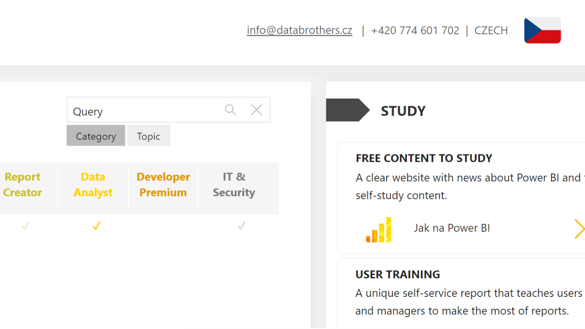

# Text search slicer
Customizable Power BI slicer that enables searching within one or more text fields.

## Issues 🐞
- Filtering hierarchy fields is not supported.

*Feel free to create an **issue** with the problem description or **contact us** at [info@databrothers.cz](mailto:info@databrothers.cz).*

## Installation 🔨
- Text search slicer is now available in the **[Power BI AppSource](https://appsource.microsoft.com/en-us/product/power-bi-visuals/databrotherssro1596013704866.dbi_text_search_slicer)**. 

## How to use 👩‍💻
### Setup
1) After installing the visual and placing it in your canvas, add **one or more text fields** in the visual setup pane.
2) The input field of the slicer should be now visible.

### Searching
1) Type any text in the input field and confirm it by pressing **ENTER key** or by clicking the **search button**.
2) Case-insensitive contains filter is now applied. That means it searches for the input text in any part of the selected field and it **ignores lower and upper cases**. 
3) Filter also supports **wildcard characters**. 
    - A question mark **(?)** for any single character. 
    - An asterisk **(*)** for any sequence of characters. 
    - When searching for an actual question mark or asterisk, place a tilde **(~)** before the character.
4) If any changes are made in the input field and they are **not confirmed** then the slicer fallbacks to its **last state**.

### Searching within more text fields
1) After adding **more than one text fields** in the visual setup pane, **additional buttons** are displayed under the input field.
2) If the button is **highlighted** it means that filter is going to be applied to the corresponding field.
3) It is possible to **change currently filtered field** by clicking the **corresponding button**. 
4) If any search is already applied and the filtered field is changed then the new filter is **applied immediately without confirming by ENTER key or the search button**.

### Removing the filter
1) The filter is removed after pressing the **clear button** or after **confirming an empty search**.

### Formatting
- **General** - customization for the entire visual. *(font family, font size)*
- **Input field** - customization for the input field. *(color, padding, border, placeholder)*
- **Input field action** - customization for the search and clear buttons. *(color)*
- **Field selection** - customization for the searched field switching buttons. *(color, border, padding)*

## Support 💛

Do not forget to write a review in the **[Power BI AppSource](https://appsource.microsoft.com/en-us/product/power-bi-visuals/databrotherssro1596013704866.dbi_text_search_slicer)**.